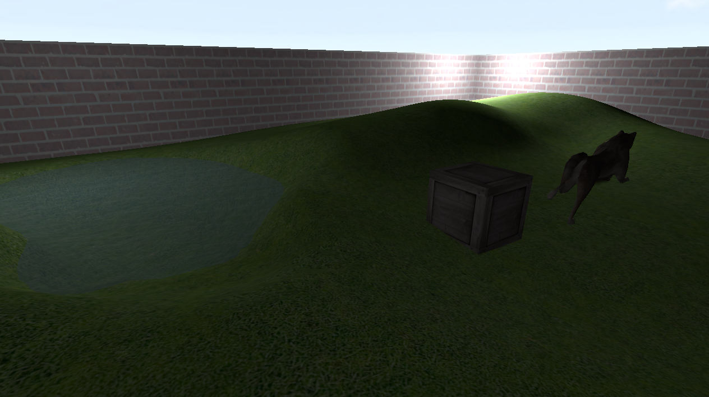

# cubik

 

OpenGL/glium-based multiplayer 3D game framework written in Rust.

## Features

- Built-in shaders for 3D scene, UI and skybox
- Skybox rendering
- WASD + mouse FPS camera
- Wavefront OBJ support
- Ambient & point lighting
- Maps in OBJ format
  - Entities such as lights and spawn points detected by object name prefix
- Texture loading supports multiple image formats
- Simple animation system (using one OBJ per frame)
- Network communication framework (server / client)
- Interpolation functions for smooth player movements on client-side
- Quad-octree implementation for collision detection
- UI framework with font loading, text inputs, buttons and more
- Audio loading / playback
- Simple cube object creation function
- Functions for finding assets in relevant directories

## Examples

Examples are provided in this library. Each example can be run using `cargo run --example <example name>`

- `rough`: Shows a simple scene with a torus, a cube and an animated wolf
- `chat_server`: Launches a server which demonstrates basic network communication, delegates received messages to other clients
- `chat_client`: Launches a client that sends messages every second or so to the server
- `player_server`: Launches a server for a simple scene
- `player_client`: Launches a client, connects to server and presents simple scene
